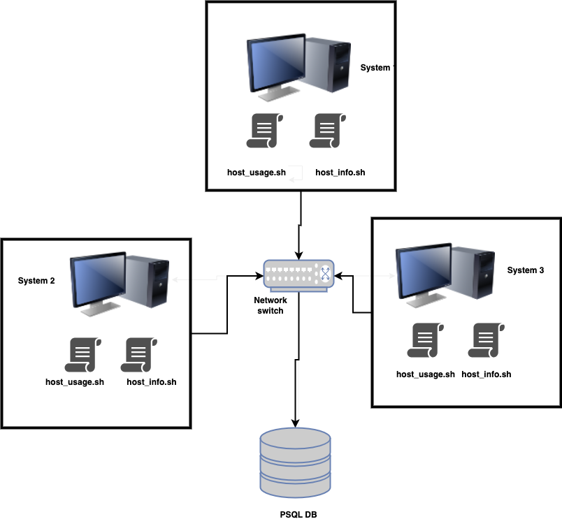

# Linux Cluster Monitoring Agent
***
## Introduction
***
The Linux Monitoring agent is a tool which allows the user to monitor resource utilization on the linux servers. This tool track records of server utilization every minute and provide real time resource usage to the users which is then stored in the PSQL DB.

The stored data can be used to generate reports to analyse the resource usage along with the hardware specifics of every node in the cluster.

The technology used are Bash scripts, POSTgreSQL, docker, IDE etc.

## Quick Start
***
- Start a psql instance using psql_docker.sh
- Create tables using ddl.sql
- Insert hardware specs data into the DB using host_info.sh
- Insert hardware usage data into the DB using host_usage.sh
- Crontab setup

## Implementation
***
To implement this tool, we setup docker container and created an instance of PSQL using docker.
- psql is the instance created to register the data collected from running the following two files.
- host_info.sh script is created to collect host hardware info and added to the DB when the system is installed.
- host_usage.sh is the script created to run every minute in the host system to keep track of the system usage (CPU, disk etc) and stored in the DB.
- cron job is run every minute to collect system info and a log file is created which stores information it generated from running that cron.

## Architecture and Design
 

In the above diagram there are clusters connected with network switch and the cluster is monitored using the linux monitoring tool. Every node consists of two scripts, host_info script runs when the system is installed and host_usage script  is run every minute to collect the data from the nodes and the data is stored in PSQL DB.

## Scripts
***

- psql_docker.sh: It checks the status of the container and creates one if not created.
- host_info.sh: It collects hardware info of host and inserts data in DB,
- host_usage.sh: It collects host system usage info and stores in DB.
- crontab: Runs the script of host_usage.sh every min.
- ddl.sql: Creates tables of host_usage and host_info in DB.

## Database Modeling
***

- host_info:

| Column Name      | Data Type |
|------------------|-----------|
| id               | Serial|
| cpu_number       | INT2|
| cpu_architecture | VARCHAR|
| cpu_model        | VARCHAR|
| cpu_mhz          | FLOAT8|
| l2_cache         | INT4| 
|timestamp| TIMESTAMP|
|total_mem|INT4|

- host_usage:

| Column Name    | Data Type |
|----------------|-----------|
| timestamp      | TIMESTAMP |
| host_id        | Serial    |
| memory_free    | INT4      |
| cpu_idle       | INT2      |
| cpu_kernel     | INT2      |
| disk_io        | INT4      |
| disk_available | INT4      | 

## Test
***

We created a single node and installed all the prerequisite software. Every bash script created was tested by running and checking the data manually. To verify that the script ran successfully, I checked the database by running the select query and verifying the data against test data.

This setup also will work when used a in cluster assuming the connection and firewall is setup as well.

## Deployment
***
The program uses Github to manage its code and Docker for provisioning the Database. We use cron to run the scripts on scheduled time.

## Improvements
***
- We can generate comprehensive reports and dashboards to analyze the system performance.
- Setting up alerts to identify poor performing node.
- We can make the system support multiple linux distributions.
